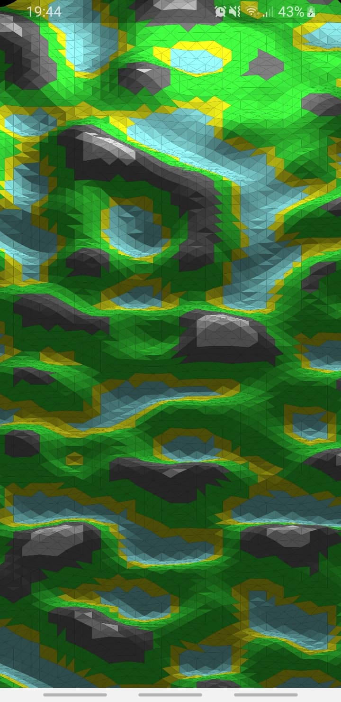

<!-- ABOUT THE PROJECT -->
# About The Project

This project is my first atempt to create an Android application using C.  
Everything may not be perfect so feel free to submit a pull request if you'd like to improve it !

The aim of this project is to provide a starting point for someone who'd like to use this stack.  
I tried to go as deep as possible with the possibilities offered by Dart:ffi (map.dart & map_test.dart files).  
Don't forget the star if I helped you !

<p align="center">
    
</p> 
The 2D isometric map is created with C & displayed with the Flutter's CustomPainter. 

### Built With

* [Flutter](https://flutter.dev/) for the mobile app. 
* C for the map creation.
* [Docker](https://www.docker.com/) & [VS Code](https://code.visualstudio.com/) for the dev environment.


<!-- GETTING STARTED -->
# Getting Started

At the moment the project only runs on Linux with an Android device, do not hesitate to create a pull request if you made it work on another platform !

### Prerequisites

You need to have [**Docker** installed](https://docs.docker.com/get-docker/).
Do not forget to add your user to the “docker” group :
   ```sh
   sudo usermod -aG docker $USER && newgrp docker
   ```

The second tool you need is **VS Code** with two extensions : Remote - Containers & Docker

### Installation

1. Clone the repo
2. On VS, click the bottom left *Remote - Containers* icon and select *Open Folder in Container* with the repo as folder.
3. Plug you device & run /lib/main.dart

Et voilà !

<!-- CONTRIBUTING -->
## Contributing

Contributions are what make the open source community such an amazing place to be learn, inspire, and create. Any contributions you make are **greatly appreciated**.

1. Fork the Project
2. Create your Feature Branch (`git checkout -b feature/AmazingFeature`)
3. Commit your Changes (`git commit -m 'Add some AmazingFeature'`)
4. Push to the Branch (`git push origin feature/AmazingFeature`)
5. Open a Pull Request


## Sources
[Readme](https://github.com/othneildrew/Best-README-Template)  
[Dev environment](https://blog.codemagic.io/how-to-dockerize-flutter-apps/)  
[Perlin Noise](https://en.wikipedia.org/wiki/Perlin_noise)  
